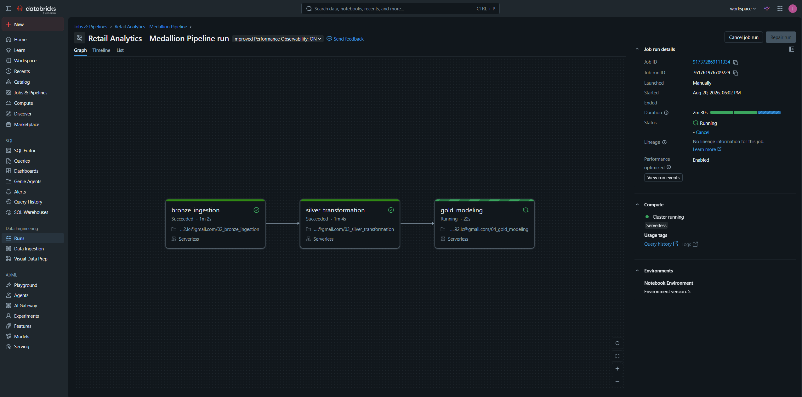
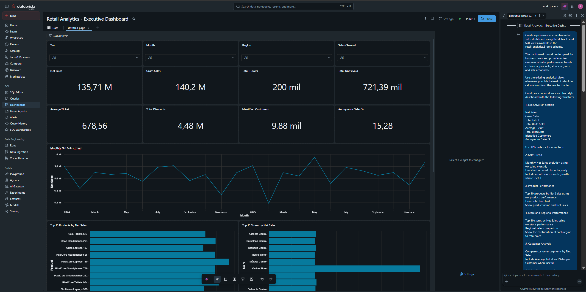
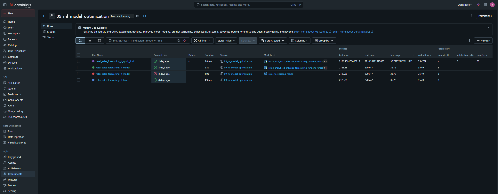
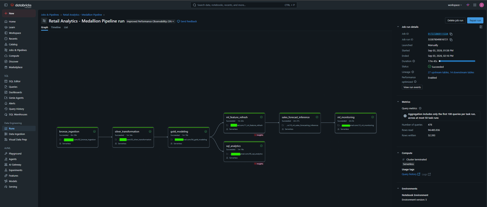
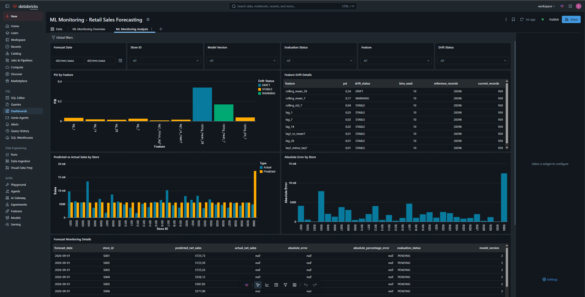

# Retail Analytics & ML Forecasting Platform

End-to-end **Data Engineering, Analytics and Machine Learning** project built on Databricks for retail sales analysis and store-level sales forecasting.

**Landing → Bronze → Silver → Gold → Analytics → Feature Engineering → Training → Inference → ML Monitoring → Dashboards & Alerts**

The platform also implements reproducible deployment and environment promotion using **Databricks Asset Bundles and GitHub Actions CI/CD**.

## 1. Objective

The platform covers the complete lifecycle of a retail data and ML solution:

- historical and incremental ingestion;
- Medallion Architecture;
- dimensional modeling for analytics;
- daily store-level net-sales forecasting;
- MLflow model tracking and versioning;
- forecast-vs-actual evaluation;
- store-level model performance;
- Feature Drift and PSI monitoring;
- persistent monitoring history in Delta;
- dashboards and alerts;
- end-to-end orchestration with Lakeflow Jobs;
- multi-environment deployment with DEV and PROD;
- CI/CD with GitHub Actions and Databricks Asset Bundles.

## 2. Technology Stack

- Databricks
- Apache Spark / PySpark / Spark SQL
- Delta Lake
- Unity Catalog and Volumes
- Auto Loader
- Lakeflow Jobs
- MLflow
- Spark ML
- Random Forest Regression
- Databricks SQL
- Databricks Dashboards
- Databricks Asset Bundles
- Git / GitHub
- GitHub Actions

## 3. Architecture

```text
Source Files
    ↓
Landing / Unity Catalog Volumes
    ↓
Bronze
    ↓
Silver
    ↓
Gold
    ├──────────────→ SQL Analytics
    ↓
ML Feature Engineering
    ↓
Model Training / Tuning
    ↓
MLflow + Unity Catalog
    ↓
Sales Forecast Inference
    ↓
ML Monitoring
    ├──────────────→ Delta Monitoring History
    ├──────────────→ Dashboards
    └──────────────→ Alerts
```

### Architecture in Databricks

The platform is implemented as an end-to-end Medallion workflow, integrating Data Engineering, Analytics and Machine Learning.



## 4. Data Engineering

### Landing

Source files for customers, products, stores and sales are stored in Unity Catalog Volumes.

### Bronze

Raw ingestion layer. The design supports idempotent and incremental processing while preserving source-level information.

### Silver

Validated and standardized data layer. It handles schema normalization, data types, business rules, duplicate control, null analysis and consistency checks. Anonymous sales are intentionally preserved.

### Gold

Analytics-ready dimensional **Star Schema**.

Dimensions:

- `dim_customer`
- `dim_product`
- `dim_store`
- `dim_date`

Fact:

- `fact_sales`

The fact-table grain is a sales line identified by `sale_id + line_id`.

## 5. Analytics

Gold is consumed through Databricks SQL views and dashboards for sales trends, product/store performance, regional analysis, gross/net sales, tickets, units, average ticket, discounts and identified vs anonymous customers.

### Executive Dashboard

The Gold analytical layer feeds an executive dashboard covering business KPIs, sales trends and product/store performance.



## 6. Machine Learning

The ML use case forecasts **daily net sales at store level**.

Temporal features include:

- `lag_1`
- `lag_7`
- `lag_14`
- `lag_28`
- `rolling_mean_7`
- `rolling_mean_28`
- `rolling_std_7`
- `lag1_minus_lag7`
- `lag1_vs_mean7`

Features are built using information available before the prediction date to avoid target leakage. Time-series datasets are split chronologically rather than randomly.

Random Forest regression configurations are trained and compared. Model selection considers predictive performance and unnecessary complexity.

MLflow and Unity Catalog provide experiment tracking, metrics, parameters, model artifacts, registration, versioning and inference traceability.

### MLflow Experiment Tracking

Model configurations are tracked and compared through MLflow using validation and test metrics, parameters and registered model versions.



## 7. Forecast Inference

Forecasts are persisted by:

- `forecast_date`
- `store_id`
- `model_name`
- `model_version`

When actual sales are unavailable, a forecast remains `PENDING`.

Once actual sales arrive, the original prediction can be evaluated without regenerating it.

## 8. ML Monitoring

The monitoring layer evaluates:

- Forecast Quality
- Model Performance
- Store-Level Performance
- Feature Drift
- Population Stability Index (PSI)

Operational PSI thresholds:

```text
PSI < 0.10          → STABLE
0.10 <= PSI < 0.25  → WARNING
PSI >= 0.25         → DRIFT
```

A feature that cannot be evaluated reliably can be classified as `NOT_EVALUABLE`.

## 9. Pipeline Health vs Model Health

A core design decision is the separation between technical execution and functional ML health.

A functional `CRITICAL` monitoring state:

- is persisted;
- can be visualized;
- can trigger alerts;
- does not automatically fail a technically correct Lakeflow Job.

Technical failures are reserved for genuine execution problems.

## 10. Lakeflow Orchestration

Validated workflow:

```text
bronze_ingestion
        ↓
silver_transformation
        ↓
gold_modeling
   ├────────────→ sql_analytics
   ↓
ml_feature_refresh
        ↓
sales_forecast_inference
        ↓
ml_monitoring
```

The complete end-to-end Job has been executed successfully.

Each task receives the target Unity Catalog catalog through the Databricks Asset Bundle variable `${var.catalog}`.

This allows the same notebooks and Job definition to run across different environments without hardcoding environment-specific catalog names.

### End-to-End Execution

The production-style workflow orchestrates Data Engineering, Analytics, Feature Engineering, Forecast Inference and ML Monitoring as a single dependency graph.



## 11. Monitoring Dashboard

### ML Monitoring Overview

Executive monitoring:

- Forecast Quality
- Feature Drift
- Global Status
- Model Performance
- Feature Drift distribution

### ML Monitoring Analysis

Operational analysis:

- PSI by Feature
- Feature Drift details
- Predicted vs Actual Sales by Store
- Absolute Error by Store
- Forecast Monitoring details

The monitoring dashboard provides operational visibility into forecast performance and feature drift, including PSI-based drift detection and store-level prediction errors.



## 12. Multi-Environment Deployment

The project uses **Databricks Asset Bundles** to provide reproducible deployment across isolated DEV and PROD targets.

| Environment | Unity Catalog | Bundle Mode | Deployment |
|---|---|---|---|
| DEV | `retail_analytics_dev` | Development | Automatic after merge to `main` |
| PROD | `retail_analytics` | Production | Manual controlled promotion |

The target catalog is configured through:

```text
${var.catalog}
```

The same notebooks and Lakeflow Job definition are therefore reused across both environments.

### DEV

DEV uses:

```text
retail_analytics_dev
```

The Databricks Asset Bundle manages the following schemas:

```text
1_bronze
2_silver
3_gold
5_ml
```

This allows the development environment to be provisioned reproducibly from the Bundle configuration.

### PROD

PROD uses:

```text
retail_analytics
```

The production schemas already existed before the infrastructure-as-code implementation.

For this reason, the Bundle reuses those schemas rather than attempting to recreate or take ownership of them.

The production Bundle manages the deployed Lakeflow Job while the existing production data structures remain preserved.

## 13. CI/CD

The repository implements CI/CD using **GitHub Actions + Databricks Asset Bundles**.

The deployment lifecycle is:

```text
Feature / Fix Branch
        ↓
Pull Request
        ↓
GitHub Actions CI
        ↓
databricks bundle validate -t dev
        ↓
Merge to main
        ↓
GitHub Actions CD
        ↓
Validate DEV
        ↓
Deploy DEV automatically
        ↓
Manual PROD Promotion
        ↓
Validate PROD
        ↓
Deploy PROD
```

### Continuous Integration

Pull requests targeting `main` automatically execute:

```bash
databricks bundle validate -t dev
```

Invalid Bundle configurations therefore fail before being merged into the stable branch.

Workflow:

```text
.github/workflows/ci.yml
```

### Continuous Deployment — DEV

Every push reaching `main` automatically executes:

```bash
databricks bundle validate -t dev
databricks bundle deploy -t dev
```

DEV therefore remains continuously deployable from the stable repository state.

Workflow:

```text
.github/workflows/cd.yml
```

### Controlled Deployment — PROD

PROD deployment is intentionally not triggered automatically by changes to `main`.

It requires an explicit manual GitHub Actions trigger.

The workflow performs:

```bash
databricks bundle validate -t prod
databricks bundle deploy -t prod
```

Workflow:

```text
.github/workflows/deploy-prod.yml
```

This provides a controlled promotion mechanism while keeping DEV deployment automated.

## 14. Repository Structure

```text
retail-analytics-databricks/
│
├── .github/
│   └── workflows/
│       ├── ci.yml
│       ├── cd.yml
│       └── deploy-prod.yml
│
├── assets/
│   └── screenshots/
│
├── docs/
│   ├── 00_repository_structure.md
│   ├── 01_architecture.md
│   ├── 02_data_pipeline.md
│   ├── 03_ml_pipeline.md
│   ├── 04_ml_monitoring.md
│   ├── 05_results_and_decisions.md
│   └── 06_cicd_and_deployment.md
│
├── notebooks/
│   ├── 01_generate_source_data.py
│   ├── 01_generate_source_data_2026.py
│   ├── 02_bronze_ingestion.py
│   ├── 03_silver_transformation.py
│   ├── 04_gold_modeling.py
│   ├── 05_sql_analytics.py
│   ├── 06_incremental_validation.py
│   ├── 07_performance_optimization.py
│   ├── 08_ml_sales_forecasting.py
│   ├── 08_ml_sales_forecasting_tuning.py
│   ├── 09_ml_model_optimization.py
│   ├── 10_ml_sales_forecasting_inference.py
│   ├── 11_ml_feature_refresh.py
│   └── 12_ml_monitoring.py
│
├── resources/
│   ├── jobs.yml
│   └── resources.yml
│
├── databricks.yml
├── .gitignore
└── README.md
```

## 15. Deployment Commands

Validate DEV:

```bash
databricks bundle validate -t dev
```

Validate PROD:

```bash
databricks bundle validate -t prod
```

Inspect DEV resources:

```bash
databricks bundle summary -t dev
```

Inspect PROD resources:

```bash
databricks bundle summary -t prod
```

Deploy DEV:

```bash
databricks bundle deploy -t dev
```

Deploy PROD:

```bash
databricks bundle deploy -t prod
```

Run the complete DEV pipeline:

```bash
databricks bundle run -t dev retail_analytics_pipeline
```

The normal project lifecycle uses GitHub Actions for deployment rather than requiring these deployment commands to be executed manually.

## 16. Project Status

| Component | Status |
|---|---|
| Data ingestion | Complete |
| Bronze / Silver / Gold | Complete |
| Incremental processing | Complete |
| SQL Analytics | Complete |
| ML Feature Engineering | Complete |
| Model Training / Tuning | Complete |
| MLflow / Model Registry | Complete |
| Forecast Inference | Complete |
| ML Monitoring | Complete |
| Monitoring persistence | Complete |
| Dashboards & Alerts | Complete |
| Lakeflow orchestration | Complete |
| End-to-end validation | Complete |
| Databricks Asset Bundles | Complete |
| DEV / PROD separation | Complete |
| CI validation | Complete |
| Automatic DEV deployment | Complete |
| Controlled PROD deployment | Complete |

## 17. Documentation

Detailed technical documentation is available under `/docs`:

- `00_repository_structure.md` — repository organization.
- `01_architecture.md` — end-to-end platform architecture.
- `02_data_pipeline.md` — Data Engineering pipeline.
- `03_ml_pipeline.md` — forecasting and ML lifecycle.
- `04_ml_monitoring.md` — monitoring strategy and implementation.
- `05_results_and_decisions.md` — project results and architectural decisions.
- `06_cicd_and_deployment.md` — Databricks Asset Bundles, DEV/PROD and CI/CD.
